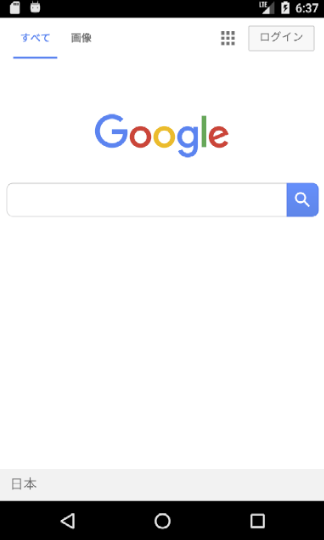

# WIP 2018-01-17

# Preface

This will explain how to create a webview plugin for Android and iOS

# Documentation

## How it looks like
### Android

### iOS

# How to use

1. Copy Plugins folder to your project
2. Launch app and test

## Entry point

1. Assets/TestWebView.cs
2. Assets/Plugins/Android or Assets/Plugins/iOS